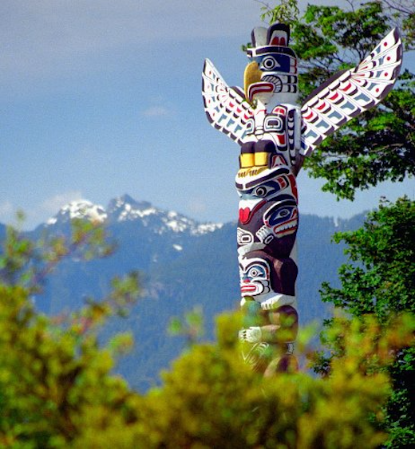
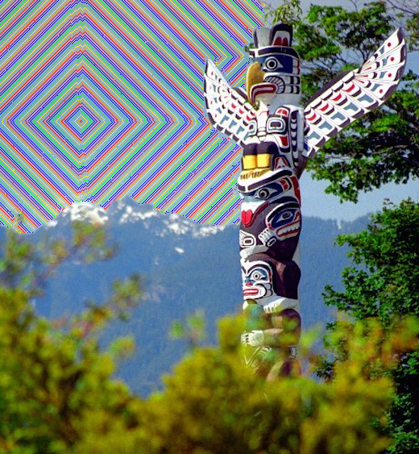

# PNG Photo Mosaic

Completed in cs221 class. Given a PNG, the (x,y) coordinates of desired center, and a string that classifies desired colors. Adds rings of colored pixels at the given center, using Breadth First Search.

